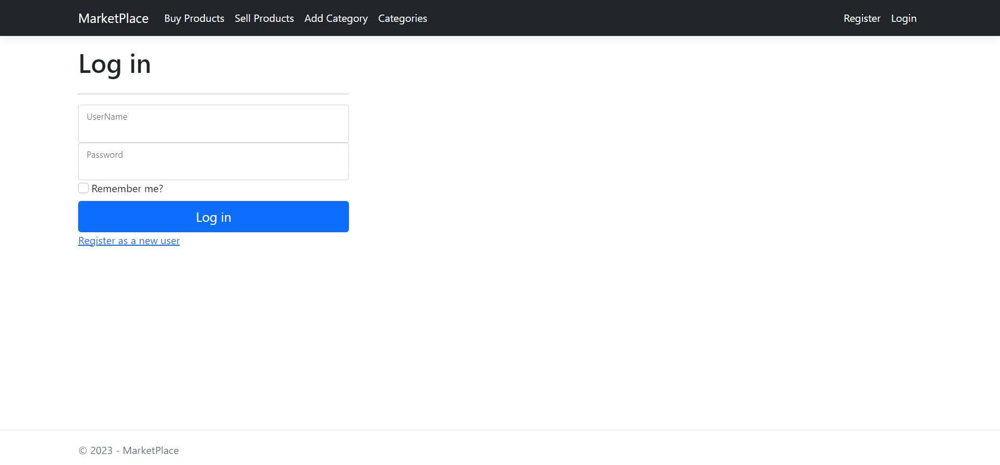
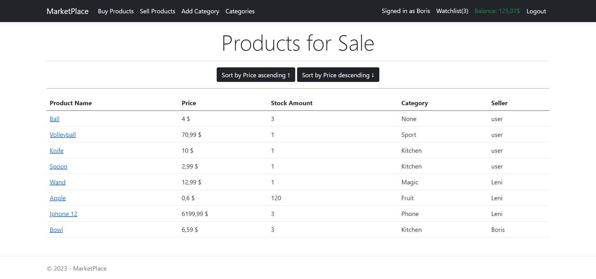
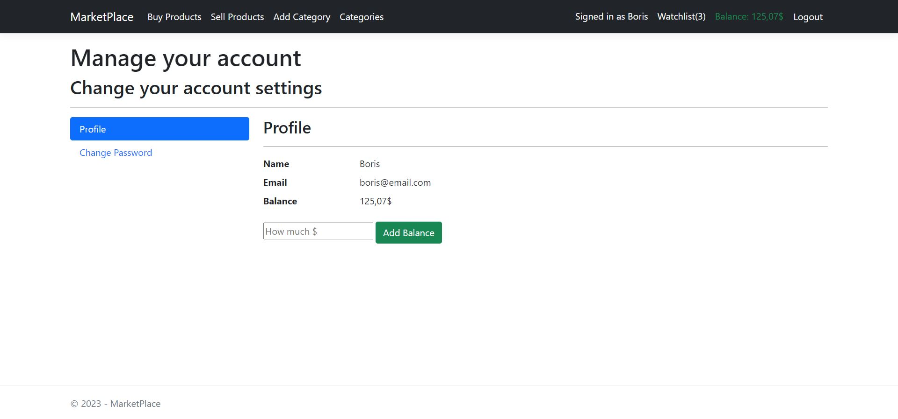
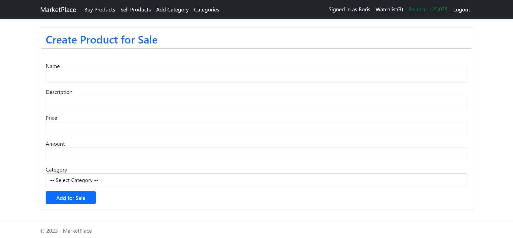
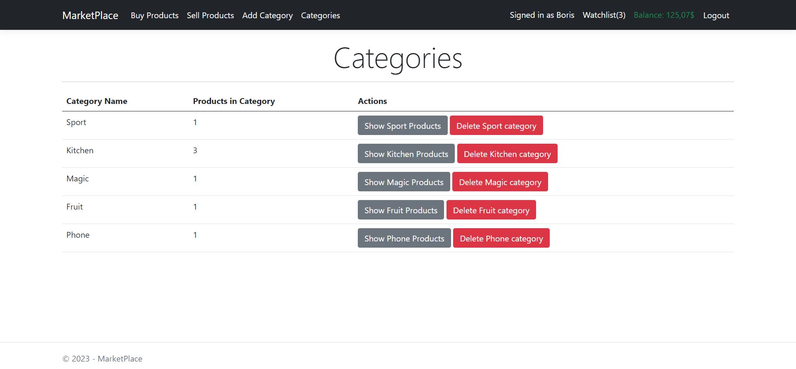
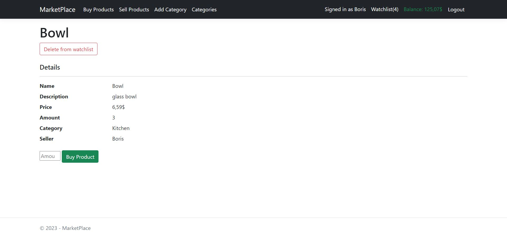

# MarketPlace
This is a web application for simulating MarketPlace and served as my introduction to ASP.NET framework. I created this app as my final project for subject [PV178 - Introduction to C#/.NET](https://is.muni.cz/predmet/fi/jaro2023/PV178?lang=en).

## Technologies
- .NET 6
- ASP.NET Core
- Entity Framework Core
- MS SQL
- Razor Pages
- Bootstrap

## Functionality
- User can create an account
- Every account has its identity, balance, watchlist, owned products
- Unsigned users have limited access to some parts of the app
- Add/Delete from watchlist
- Buying products
- Selling products
- Listing products: all / by category
- Listing categories
- Sorting of listed products
- Balance transactions between buyers and sellers

## Showcase

